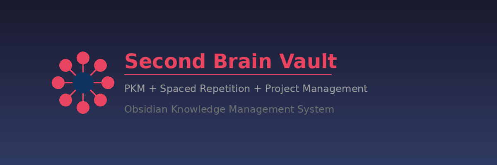
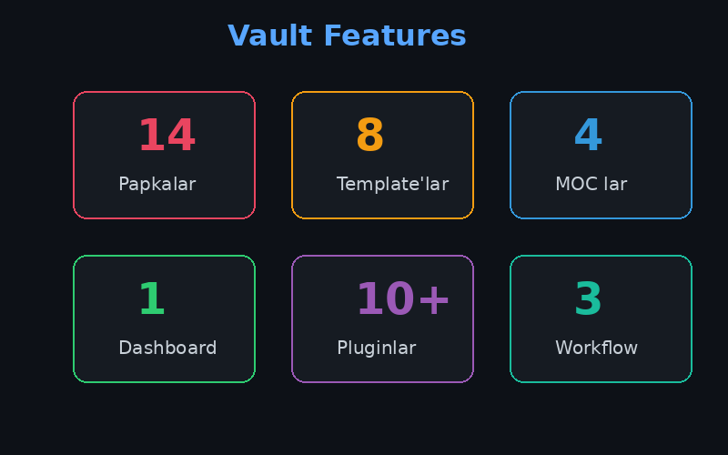
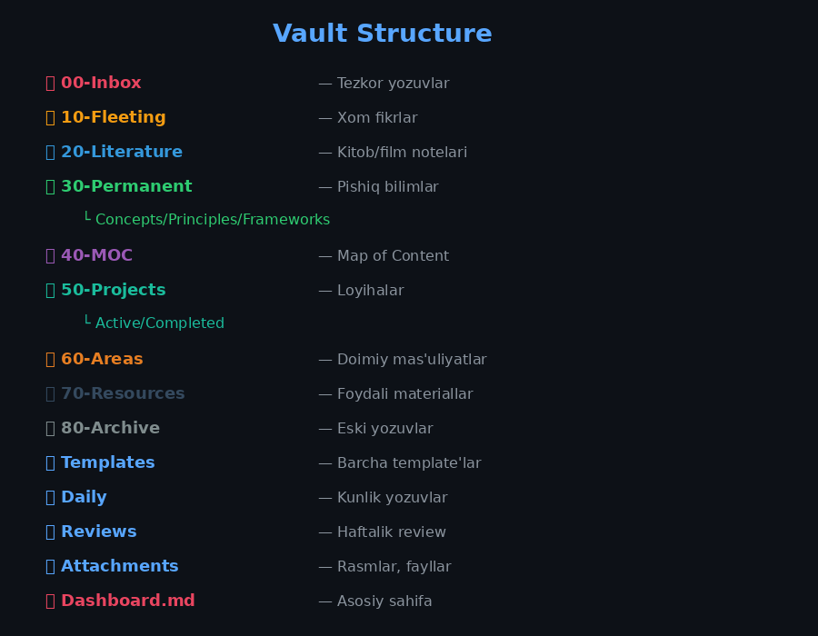
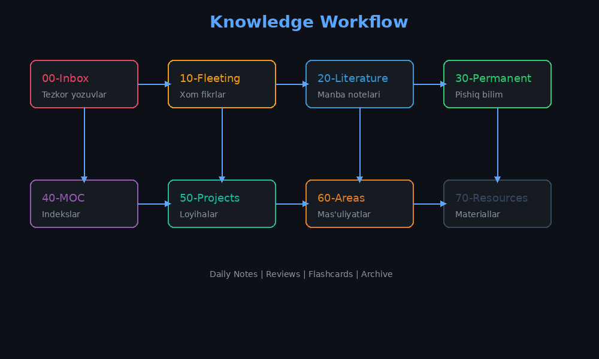

# 🧠 Ikkinchi Miya — Obsidian Vault

<p align="center">
  
</p>

<p align="center">
  <strong>PKM (Personal Knowledge Management) + Spaced Repetition + Project Management</strong>
</p>

<p align="center">
  <a href="#-strukturasi">Struktura</a> •
  <a href="#-boshlash">Boshlash</a> •
  <a href="#-workflow">Workflow</a> •
  <a href="#-template-lar">Template'lar</a> •
  <a href="#-pluginlar">Pluginlar</a> •
  <a href="#-litsenziya">Litsenziya</a>
</p>

---

<p align="center">
  
</p>

## 📂 Strukturasi

<p align="center">
  
</p>

```
📁 00-Inbox          # Tezkor yozuvlar (qayta ishlanmagan)
📁 10-Fleeting       # Xom fikrlar, kuzatishlar
📁 20-Literature     # Kitob/film/maqola notelari
📁 30-Permanent      # Pishiq, bog'langan bilimlar
  📁 Concepts/
  📁 Principles/
  📁 Frameworks/
📁 40-MOC            # Map of Content (indekslar)
📁 50-Projects       # Aktiv va tugallangan loyihalar
  📁 Active/
  📁 Completed/
📁 60-Areas          # Doimiy mas'uliyatlar
📁 70-Resources      # Foydali materiallar
📁 80-Archive        # Eski/tugallangan narsalar
📁 Templates         # Barcha template'lar
📁 Daily             # Kunlik yozuvlar
📁 Reviews           # Haftalik/oylik review'lar
📁 Attachments       # Rasmlar, fayllar
📄 Dashboard.md      # Asosiy bosh sahifa
```

## 🔄 Workflow

<p align="center">
  
</p>

### Kunlik
1. **Ertalab:** Daily Note oching (Calendar plugin)
2. **Fikr keldi:** QuickAdd → `00-Inbox`
3. **Flashcard:** Spaced Repetition → Review
4. **Kechqurun:** Daily Note'ni yakunlang

### Haftalik
1. **Inbox tozalash:** `00-Inbox` → `10-Fleeting` yoki `20-Literature`
2. **Fikrlarni pishitish:** `10-Fleeting` → `30-Permanent` (bog'lash)
3. **Weekly Review:** `Templates/Weekly Review` → `Reviews/`

### Oylik
1. **MOC yangilash:** Yangi tushunchalarni bog'lash
2. **Loyiha review:** Aktiv loyihalarni tekshirish
3. **Archive:** Eski yozuvlarni `80-Archive` ga ko'chirish

## 🚀 Boshlash

### 1. Vault'ni Ochish
- Obsidian → "Open folder as vault" → `Obsidian-Vault` papkasini tanlang

### 2. Plugin'larni O'rnatish
`Settings → Community Plugins → Browse` orqali quyidagilarni o'rnating:

**Majburiy:**
- [Templater](https://github.com/silentvoid13/Templater) — Avtomatik template'lar
- [Dataview](https://github.com/blacksmithgu/obsidian-dataview) — Dinamik query'lar
- [Calendar](https://github.com/liamcain/obsidian-calendar-plugin) — Kunlik navigatsiya
- [Kanban](https://github.com/mgmeyers/obsidian-kanban) — Loyiha boshqaruvi
- [Spaced Repetition](https://github.com/st3v3nmw/obsidian-spaced-repetition) — Flashcard takrorlash

**Foydali:**
- [Tasks](https://github.com/obsidian-tasks-group/obsidian-tasks) — Task tracking
- [QuickAdd](https://github.com/chhoumann/quickadd) — Tezkor note qo'shish
- [Excalidraw](https://github.com/zsviczian/obsidian-excalidraw-plugin) — Diagramma/chizma
- [Various Complements](https://github.com/tadashi-aikawa/obsidian-various-complements-plugin) — Auto-complete
- [Periodic Notes](https://github.com/liamcain/obsidian-periodic-notes) — Haftalik/Oylik yozuvlar

### 3. Sozlamalar
**Settings → Core Plugins:**
- Daily Notes → Folder: `Daily`
- Daily Notes → Date format: `YYYY-MM-DD`
- Daily Notes → Template: `Templates/Daily Note`
- Templates → Template folder: `Templates`

**Settings → Community Plugins:**
- Templater → Template folder: `Templates`
- Spaced Repetition → Flashcard tag: `#flashcard`

## 📝 Template'lar

| Template | Maqsad |
|----------|--------|
| [Daily Note](Templates/Daily%20Note.md) | Kunlik reja, fikrlar, flashcard review |
| [Fleeting Note](Templates/Fleeting%20Note.md) | Tezkor fikr capture |
| [Literature Note](Templates/Literature%20Note.md) | Kitob/film/maqola summary |
| [Permanent Note](Templates/Permanent%20Note.md) | Pishiq bilim, bog'langan |
| [MOC](Templates/MOC.md) | Mavzu indeksi |
| [Flashcard](Templates/Flashcard.md) | Spaced repetition uchun |
| [Project](Templates/Project.md) | Loyiha boshlash |
| [Weekly Review](Templates/Weekly%20Review.md) | Hafta yakuni |

## 🧠 Zettelkasten Prinsiplari

1. **Atomic:** Har bir note bitta g'oya
2. **Connected:** Har bir note kamida boshqa bir notega bog'langan
3. **Own words:** O'z so'zlaringiz bilan yozing
4. **Progressive:** Vaqt o'tishi bilan boyib boradi

## 📊 Dashboard

`Dashboard.md` faylini oching — barcha aktiv narsalarni bir joyda ko'rasiz:
- 📥 Inbox notelari
- 🚀 Aktiv loyihalar
- 📖 O'qilayotgan manbalar
- 🗺️ MOC lar
- 🧠 Flashcard statistika

## 🗺️ Map of Content (MOC)

Vault ichida 4 ta asosiy MOC mavjud:
- **[MOC - Asosiy](40-MOC/MOC%20-%20Asosiy.md)** — Bosh navigatsiya markazi
- **[MOC - O'rganish](40-MOC/MOC%20-%20O'rganish.md)** — Bilim olish jarayoni
- **[MOC - Loyihalar](40-MOC/MOC%20-%20Loyihalar.md)** — Aktiv loyihalar
- **[MOC - Fikrlar](40-MOC/MOC%20-%20Fikrlar.md)** — Fleeting va permanent notelar

## 🤝 Contributing

1. Fork qiling
2. Feature branch yarating (`git checkout -b feature/YangiXususiyat`)
3. O'zgarishlarni commit qiling (`git commit -m 'Yangi xususiyat qo'shildi'`)
4. Push qiling (`git push origin feature/YangiXususiyat`)
5. Pull Request oching

## 📄 Litsenziya

Bu loyiha [MIT License](LICENSE) ostida tarqatilgan.

## 👨‍💻 Muallif

**SardorCyberSafe**
- GitHub: [@SardorCyberSafe](https://github.com/SardorCyberSafe)

---

<p align="center">
  <strong>Yaxshi o'rganishlar! 🚀</strong>
</p>

<p align="center">
  ⭐ Agar yoqqan bo'lsa, yulduz qoldiring!
</p>
